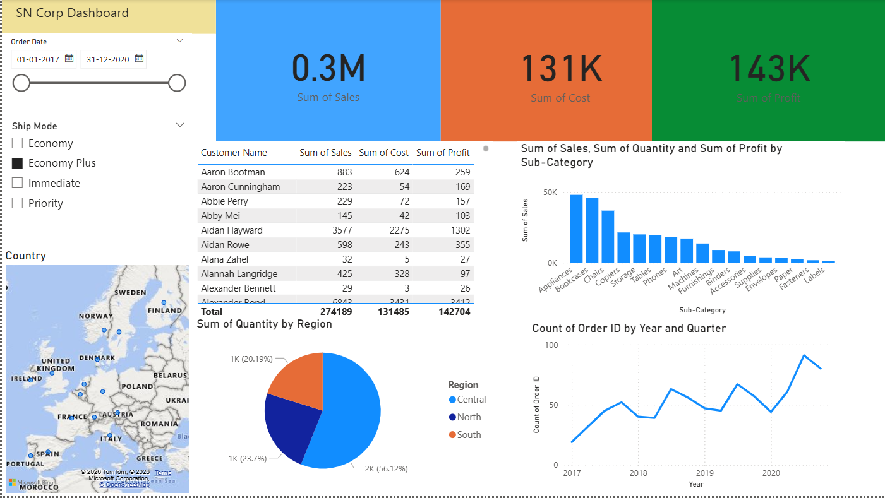

# 📊 SN Corp Sales Dashboard (Power BI)

## 📌 Project Overview
The **SN Corp Sales Dashboard** is an interactive Power BI project developed to analyze and visualize sales data using the **Superstore** dataset. The dashboard provides valuable business insights through dynamic visualizations, key performance indicators (KPIs), and interactive filters, enabling users to monitor sales performance, customer behavior, product performance, and regional trends.

## 🎯 Project Objective
The objective of this project is to develop an interactive Business Intelligence dashboard that helps stakeholders:
- Monitor overall sales performance.
- Analyze profit and cost across different regions.
- Identify top-performing products and customer segments.
- Support data-driven business decisions through interactive visualizations.

## 🛠️ Tools & Technologies
- Microsoft Power BI Desktop
- Microsoft Excel
- Power Query
- DAX (Data Analysis Expressions)
- Data Visualization

## 📂 Dataset
**Superstore Sales Dataset (Excel)**

The dataset contains information related to:
- Orders
- Customers
- Products
- Sales
- Profit
- Shipping
- Regional Performance

## 📈 Dashboard Features
- 📌 Total Sales KPI
- 💰 Total Profit KPI
- 💸 Total Cost KPI
- 📊 Sales by Product Sub-Category
- 👥 Customer-wise Sales Analysis
- 🌍 Region-wise Sales Distribution
- 📅 Year-wise Sales Trend Analysis
- 🎛️ Interactive Filters (Date, Ship Mode, Country)

## 💡 Key Insights
- Provides a comprehensive overview of business performance.
- Identifies top-performing product categories.
- Analyzes customer purchasing patterns.
- Compares sales performance across different regions.
- Tracks sales trends over multiple years for better decision-making.

## 📷 Dashboard Preview

## 📁 Repository Contents
- `SN_Corp_Dashboard.pbix` – Power BI Dashboard
- `Orders.xlsx` – Dataset used for analysis
- `README.md` – Project Documentation

## 🚀 Future Enhancements
- Add sales forecasting using Power BI forecasting.
- Implement advanced DAX measures.
- Include drill-through reports and bookmarks.
- Connect to live SQL databases or cloud data sources.

## 👩‍💻 Author
**Aysha S**  
Computer Science & Engineering Student  
Passionate about Data Analytics and Data Visualization.
